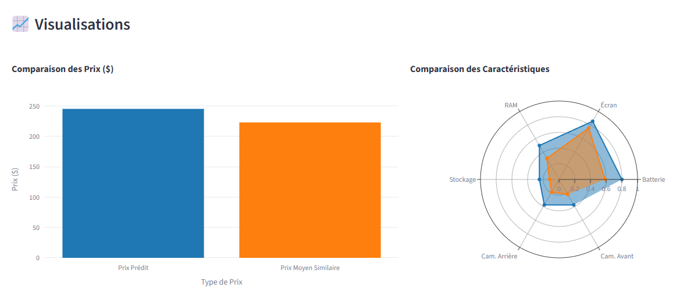
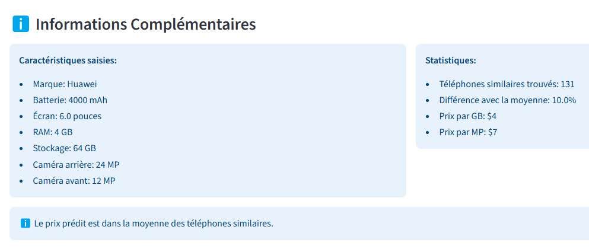

# 📱 Prédiction de Prix de Smartphones

Ce projet permet de prédire le **prix d’un smartphone** à partir de ses caractéristiques techniques (RAM, stockage, caméra, processeur, etc.) en se basant sur un modèle de machine learning entraîné sur un large dataset.

---

## 📂 Arborescence du Projet

```
├── models/                   # Modèles après entraînement (pkl)
├── screenshoot/              # Captures d’écran de l’application
├── app_streamlit.py          # Application Streamlit
├── Dockerfile                # Déploiement de l'application avec Docker
├── ndtv_data_final.csv       # Dataset utilisé pour le réentraînement
├── README.md                 # Documentation du projet
├── requirements.txt          # Bibliothèques Python nécessaires
├── retrain_model.py          # Pour réentraîner et mettre à jour le modèle
```
---

## 🚀 Fonctionnalités Clés

- 📊 Prédiction du prix du smartphone en dollars ($).
- 🔧 Ajustement automatique pour éviter les prédictions incohérentes.
- 🎯 Comparaison avec le **prix moyen de téléphones similaires** (même RAM et stockage).
- 📈 Visualisations dynamiques (barres, radar).
- 🧠 Prise en compte d'indicateurs dérivés (prix par Go, ratio batterie/écran...).
- ✅ Interface claire avec messages dynamiques (succès, alerte, info).

---

## 🧪 Caractéristiques utilisées pour la prédiction

- Marque (`Brand`)
- Processeur (`Processor`)
- Batterie (`Battery capacity (mAh)`)
- Taille écran (`Screen size (inches)`)
- RAM (`RAM (GB)`)
- Stockage (`Internal storage (GB)`)
- Caméra arrière (`Rear camera`)
- Caméra avant (`Front camera`)

Et plusieurs **caractéristiques dérivées** (créées automatiquement lors du prétraitement).

---

## 🧠 Modèle de Machine Learning

- Le modèle sélectionné correspond **au meilleur des trois testés** pour ce cas de prédiction (Linear Regression, Random Forest Regressor, Gradient Boosting Regressor).
- Entraînement réalisé sur le dataset `ndtv_data_final.csv`.
- Prétraitement incluant : encodage, scaling, et feature engineering.

---

## 🔁 Réentraînement du Modèle

Le script `retrain_model.py` permet de :
- Recharger les données
- Refabriquer toutes les variables dérivées
- Réentraîner le modèle et les encodeurs
- Sauvegarder dans le dossier `models/`

**Important** : le dossier `models/` est **inclus dans le dépôt Git** pour une exécution immédiate.

---

## 🌐 Lancement de l'application

### ✅ Option 1 — via Docker (recommandé)

1. Construire l’image Docker :
   ```bash
   docker build -t phone-price-app .
   ```

2. Lancer l’application :
   ```bash
   docker run -p 8501:8501 phone-price-app
   ```

3. Ouvrir dans un navigateur :
   [http://localhost:8501](http://localhost:8501)

---

### 💻 Option 2 — version hébergée (facultatif)

[](https://smartphone-prediction.streamlit.app)

---

## 🖼️ Aperçu

<div style="display: flex;">
  <div style="flex: 1; padding-right: 10px;">
    
  </div>
  <div style="flex: 1; display: flex; flex-direction: column; gap: 10px;">
    
    
    
  </div>
</div>


---

## 🙋‍♂️ Auteurs et Remerciements

Projet réalisé dans un cadre pédagogique.  
Merci à toutes les sources de données et bibliothèques open-source utilisées.

---

